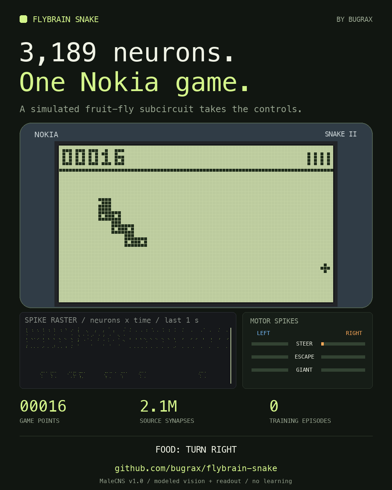

<div align="center">

# Flybrain Snake

**3,189 neurons. One Nokia game.**

A simulated fruit-fly connectome subcircuit plays a recreation of Nokia Snake II.

[Watch the video](https://github.com/bugrax/flybrain-snake/releases/download/v1.0.0/flybrain-snake-linkedin.mp4) · [How it works](docs/science.md) · [Play it yourself](#play-it-yourself)

[](https://github.com/bugrax/flybrain-snake/releases/download/v1.0.0/flybrain-snake-linkedin.mp4)

**Real connectivity · Simulated spikes · No game-policy training**

</div>

Your childhood Snake game, controlled by a small piece of a fruit fly's wiring diagram.

Flybrain Snake extracts **3,189 neurons, 111,905 connections and 2,100,007 synapses** from Janelia's **MaleCNS v1.0** dataset. A leaky integrate-and-fire simulation turns visual input into neural spikes. A declared readout rule converts left/right descending-neuron activity into turns.

The demo is a real, reproducible run: **seed 10, four food items, 16 game points, 99 steps, then a collision**. The video shows the complete episode at 3.75 game ticks per second, with a two-second introduction and a three-second ending. It was selected from 12 seeds; [the selection results](media/seed-scout.json) are included.

This is a sensorimotor experiment. The simulated subcircuit reacts to food and nearby obstacles; it has no learned Snake policy or long-term route planner. The visual frontend, neuron dynamics, and motor readout are modeling choices. The [science notes](docs/science.md) explain each assumption, including parameters tuned during development.

## Play it yourself

Requires Python 3.13 and [uv](https://docs.astral.sh/uv/getting-started/installation/). The small derived connectome is included, so you can run the simulation without downloading the full dataset.

```bash
git clone https://github.com/bugrax/flybrain-snake.git
cd flybrain-snake
uv sync

# Play the Nokia-style game yourself.
uv run python -m flysnake.play

# Watch the real connectome simulation control the game.
uv run python -m flysnake.play --agent fly --seed 10

# Try a labyrinth and a faster speed.
uv run python -m flysnake.play --maze 3 --level 7
```

| Key | Action |
| --- | --- |
| Enter | Start |
| Arrow keys, WASD, or 2 / 4 / 6 / 8 | Move up / left / right / down |
| Space, P, or 5 | Pause / resume |
| R | Restart the same seed |
| L | Cycle through nine speed levels; start a fresh game |
| M | Cycle through open play and five mazes; start a fresh game |
| Escape | Quit |

The game has an **84 × 48 monochrome LCD**, wraparound edges, a score counter, a segmented snake with a feeding animation, timed two-cell bonus creatures, five maze choices, synthesized retro blips, and a local high score. The handset artwork is drawn in code. Controls are keyboard based.

This is an independent recreation. Exact original ROM behavior has not been verified: maze layouts, the speed curve, bonus timing/scoring, sprites, and sounds are approximations. See [Snake II implementation notes](docs/snake-ii.md).

## Record the video

```bash
uv run python -m scripts.render_fly_episode \
  --seed 10 --frames-per-step 8 \
  --out media/flybrain-snake-linkedin.mp4
```

Produces a **1080 × 1350, 30 fps H.264/AAC MP4**, English captions, cover and simulation PNGs, and a JSON trace. The rendered raster and motor bars come from the same neural simulation that controls the snake. Audio is synthesized locally; no music or Nokia audio samples are used. FFmpeg can be installed separately or supplied by the bundled `imageio-ffmpeg` dependency.

The [release](https://github.com/bugrax/flybrain-snake/releases/tag/v1.0.0) includes the upload-ready video. The [LinkedIn post](docs/linkedin-post.md) is ready to copy.

## Follow the signal

```text
Game state
    ↓
Explicit visual model: food / nearby edges
    ↓
LC10a / LC4 / LPLC2 visual neurons
    ↓
Real MaleCNS connections + simulated LIF dynamics
    ↓
Left/right descending-neuron spike counts
    ↓
Declared turn-readout rule → Snake II
```

The retina is not reconstructed in this experiment. The simulated network resets before every decision and runs for 250 ms of neural time. Spike-frequency adaptation is an addition to the published LIF parameterization. No training episodes optimize a game policy, but sensory gains and readout thresholds were chosen during development.

## Reproduce the science

```bash
# Check connectivity and lateralized responses.
uv run python -m scripts.gono_go_propagation
uv run python -m scripts.tuning_sweep

# Historical walled-grid experiment: score counts food, not Nokia points.
uv run python -m scripts.play_fly --episodes 50
uv run python -m flysnake.baselines --episodes 50

# Tests, including real subcircuit propagation and game rules.
uv run pytest -q
uv run python -m flysnake.play --smoke-test
```

The historical 19 × 10 walled-grid experiment produced mean **2.48 food**, best **9**, across 50 seeds. Its random and greedy comparisons were approximately **0.10** and **49.1** mean food. These numbers belong to the earlier benchmark rules in `flysnake/game.py`; they are **not scores for the new wraparound Nokia mode**. A human-player comparison has not been measured.

To rebuild the derived subgraph from the original data:

```bash
# Downloads about 1.1 GB; already-present files are reused.
uv run python -m scripts.download_data
uv run python -m flysnake.brain
```

Source data, transformations, and licenses are documented in [THIRD_PARTY_DATA.md](THIRD_PARTY_DATA.md). Full Feather tables are excluded from Git.

## Repository map

| Path | Purpose |
| --- | --- |
| `flysnake/nokia.py`, `play.py` | Snake II recreation and playable handset |
| `flysnake/brain.py` | Subgraph extraction and LIF simulation |
| `flysnake/eye.py`, `controller.py` | Declared vision and motor-readout models |
| `flysnake/social.py`, `render.py`, `video.py` | English visuals and MP4 generation |
| `flysnake/game.py`, `baselines.py` | Reproducible historical benchmark |
| `data/subgraph_snake.npz` | Compact derived MaleCNS subgraph |
| `scripts/`, `tests/` | Experiments, recording, and validation |
| `media/`, `docs/` | Release visuals, episode trace, and explanations |

## Credits and license

Built by [bugrax](https://github.com/bugrax).

Source connectivity: [Male CNS Connectome Project](https://male-cns.janelia.org/) — FlyEM / HHMI Janelia, University of Cambridge, MRC Laboratory of Molecular Biology, and Google Research. LIF parameterization: [Shiu et al., Nature (2024)](https://doi.org/10.1038/s41586-024-07763-9).

Original code and generated artwork: [MIT](LICENSE). Derived MaleCNS data: [CC BY 4.0](https://creativecommons.org/licenses/by/4.0/) with [attribution and transformation details](THIRD_PARTY_DATA.md). Nokia and Snake II names identify the game being recreated; this project is independent and unaffiliated.
